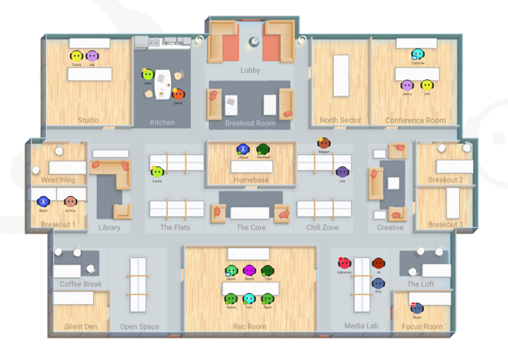
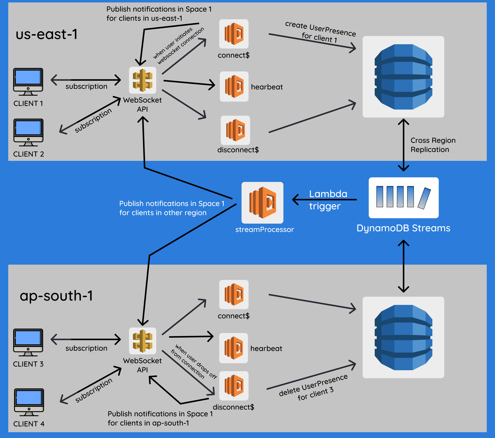
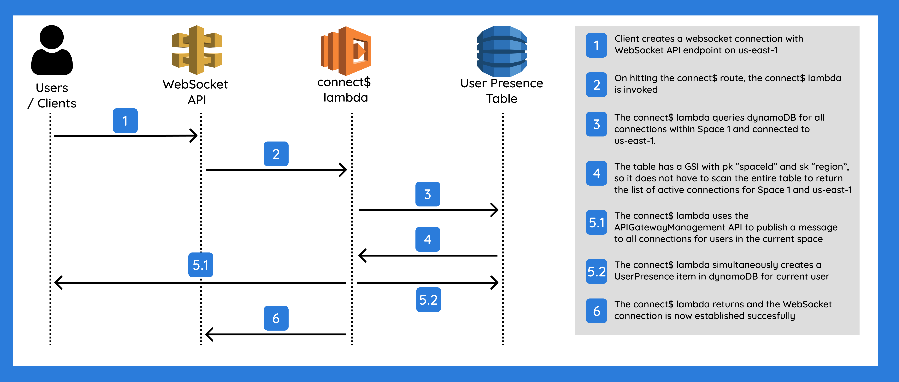

`youtube: https://www.youtube.com/watch?v=eMNpYHEv6PM`

The repository for this POC code can be found **[here](https://github.com/ashwanth1109/cross-region-realtime-presence-architecture)**.

**User presence notifications** (online/offline status indicators) are prevalent across
several modern web applications. However, the engineering that goes behind such an
implementation can prove quite tricky, especially at scale.

## Background

I recently worked on one of our flagship products called **[Sococo](https://www.sococo.com/)** as part of the "Rewrite" team
that aims to move successful legacy code-bases to the AWS cloud infrastructure.
Given the world we live in, this was a product that was gaining traction with clients.
And senior leadership wanted to expend engineering effort into migrating the product to
the AWS cloud to improve reliability, and reduce costs.
One core aspect of any online workplace software is user presence notifications.
It is important to indicate the status of each employee on the virtual map,
so that others may know whether they can ping him/her for collaboration.



During the rewrite, we discussed several solutions for user presence notifications.
We narrowed it down and went with the implementation of **UserPresence entries in DynamoDB
coupled with websocket notifications** to track changes in status.

One of the issues that we encountered was when we had a high amount of traffic
(i.e. greater number of users online in a space), presence notifications were taking longer
than usual to fire. Given that horizontally scaling the architecture was not an objective for the
rewrite, we chose not to address this problem at the time. But it was a question that I kept pondering over.

When I had an opportunity to work on any idea for our weekly tech experiment, I chose to attempt
and propose a **cross-region horizontally scaling architecture for realtime user presence notifications**.

## Problem Statement

Given that I only had a week to plan, brainstorm, experiment, propose, and implement a proof-of-concept,
the goal was to only achieve a starting point towards an architecture that could horizontally
scale. And if there was a need to implement such a solution in any future product, we could iterate off this starting point,
or explore other POCs if we wanted to consider more options in detail.

When I say *horizontal scaling*, what I mean is, we could **add more nodes to our system
and balance the incoming traffic/load across these nodes**. With horizontal scaling,
nodes can also be created in a region-specific manner - nodes in us-east-1 would mainly cater
to the traffic in us-east-1 and so on. Route53 gives us the ability to route one domain to
different nodes (or load balancers if necessary) **based on geolocation rules**, thus enabling us
to split traffic based on region. Another advantage with horizontal scaling (coupled with Kubernetes) is that if one node
goes down, we can always bring up new nodes (to handle incoming traffic) and therefore achieve **highly
available and autoscaling systems**.

## Architecture Implemented



The architecture is deployed via two CDK stacks - which deploy the same set of resources
across two different regions - `us-east-1` and `ap-south-1`.

All web clients shown in this diagram will need to connect to one `SPACE` (e.g. Space-1) to be shown as `ONLINE` to other clients.
A space can be interpreted **as a chat room or a chat group that users can enter and leave** as they wish.
Note that the two stacks in two different regions are identical nodes with the same set of resources, and all communication
between them is bidirectional.

To illustrate how this works, imagine `CLIENT 1` in `us-east-1` comes online in `SPACE 1`. User will connect
to the **WebSocket API** in the same region. Connecting to the socket triggers the `connect$` lambda.
This lambda does two things when the connection happens:
1. Create a `UserPresence` entity in DynamoDB.
2. Publish a notification to the pub-sub WebSocket API in the same region.

`CLIENT 2` will receive a notification about user coming online from this pub-sub system in `us-east-1`.
Users in other regions have still not received this notification yet though (since they subscribe to
the WebSocket API in their respective regions).

We store the `UserPresence` entity in database because any new client who logs in currently will need to initially
fetch the list of all users already online since these users came online before the WebSocket connection was established.
The `UserPresence` record in dynamoDB will automatically get replicated to a DynamoDB table in another region.
This is because the table is **defined as a global table which uses dyanamoDB streams** to sync data
across regions. This ensures databases in different regions are in sync.

We also have a `streamProcessor` lambda that is hooked to the DynamoDB stream invocations. In this lambda,
we read the data being synced and then appropriately "publish" a notification to all WebSocket APIs in all other regions,
that `CLIENT 1` has come online. It is at this point that `CLIENT 3` and `CLIENT 4` which are connected to the
pub-sub websocket mechanism in `ap-south-1` become aware of `CLIENT 1`'s online status.

Similarly, if a client goes offline, the `disconnect$` lambda is triggered, which then:
1. Deletes `UserPresence` record from DynamoDB.
2. Publishes notification within same region pub-sub that client has gone offline.
As in the previous case, DynamoDB streams and the stream processor lambda will sync these changes to other regions.

## PubSub Mechanism



When a client connects to the WebSocket API endpoint in a region, the API fires on the connect route,
which is integrated to the `connect$` lambda. When the `connect$` lambda is triggered,
it queries DynamoDB for all connections within `SPACE 1` and in the same region.

The DynamoDB table created as part of the CDK code is as follows:
```ts
const table = new Table(this, tableName, {
  tableName,
  billingMode: BillingMode.PAY_PER_REQUEST,
  partitionKey: {
    name: "connectionId",
    type: AttributeType.STRING,
  },
  stream: StreamViewType.NEW_AND_OLD_IMAGES,
  replicationRegions: ["ap-south-1"],
});

table.addGlobalSecondaryIndex({
  indexName: "space-index",
  partitionKey: { name: "spaceId", type: AttributeType.STRING },
  sortKey: { name: "region", type: AttributeType.STRING },
});
```

As you can see, the table has a `pk` of `connectionId` (i.e. the connection id of the websocket connection).
And the table has a `GSI` with a `pk` of `spaceId` and an `sk` of `region`.

The `connect$` lambda will make a query using this `GSI` to get the list of all active connections in
a particular region for a given space.

```ts
const queryParams: QueryInput = {
    TableName: TABLE_NAME,
    IndexName: "space-index",
    ExpressionAttributeNames: { "#sid": "spaceId", "#r": "region" },
    KeyConditionExpression: "#sid = :sid AND #r = :r",
    ExpressionAttributeValues: { ":sid": spaceId, ":r": AWS_REGION },
};

const { Items } = await ddb.query(queryParams).promise();
```

Once the list of all connections are fetched, the `connect$` lambda will use the `APIGateway`
management API to publish a message to all connections in parallel that current user has come online.

```ts
const apigwManagementApi = new ApiGatewayManagementApi({
    apiVersion: "2018-11-29",
    endpoint: event.requestContext.domainName + "/" + event.requestContext.stage,
});

const promises = Items?.map(async ({ connectionId, region }: any) => {
  if (region === AWS_REGION) {
    await apigwManagementApi.postToConnection({
        ConnectionId: connectionId,
        Data: JSON.stringify({
          spaceId,
          userId,
          timestamp,
          type: "USER_CAME_ONLINE",
        }),
      }).promise();
  }
});

await Promise.all(promises);
```

The `connect$` lambda also simultaneously creates a `UserPresence` entry in DynamoDB.

```ts
// Create User Presence item in DDB
const putParams: PutItemInput = {
  TableName: TABLE_NAME,
  Item: {
    connectionId: event.requestContext.connectionId,
    region: AWS_REGION,
    spaceId,
    userId,
    timestamp,
  },
};
const createdItem = await ddb.put(putParams).promise();
```

Once all this is done, the `connect$` lambda returns and the WebSocket connection is now established successfully.

## Demonstration

To see the live demonstration of this architecture in action and to quantify the performance in comparison with a single API architecture -
watch the test runs that I have recorded in video above from `7:24` onwards or on [YouTube here](https://youtu.be/eMNpYHEv6PM?t=444).

